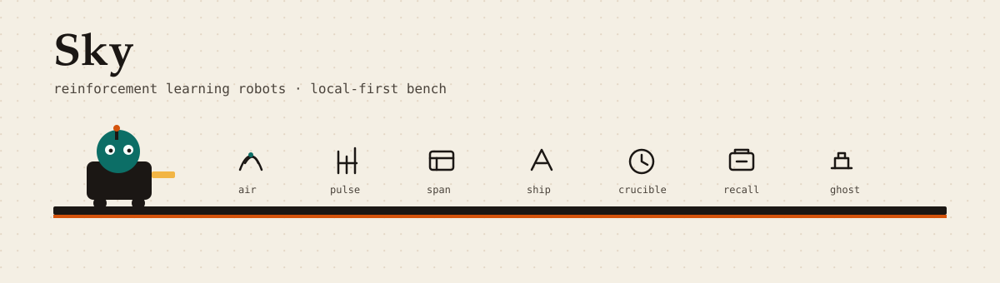

  

# Hi, I'm Sky

Reinforcement learning robots. Local-first tools with weird UIs.

[skysssup.github.io](https://skysssup.github.io/) · [@skysssup](https://x.com/skysssup)

## Selected Projects

**[airforge](https://github.com/skysssup/airforge) — air drawing → Rapier bodies**

Draw with a mouse or optional MediaPipe HandLandmarker; strokes forge into rigid bodies in a Three/R3F scene. Webcam optional — physics runs without it. [demo](https://skysssup.github.io/airforge/)

**[localpulse](https://github.com/skysssup/localpulse) — LLM cost & latency on disk**

Records tokens, latency percentiles, and estimated cost per model/route; aggregations and CSV/JSON export stay local. OpenAI-compatible capture never stores prompt text. [demo](https://skysssup.github.io/localpulse/)

**[spanforge](https://github.com/skysssup/spanforge) — agent call inspector**

Proxy records spans into waterfalls and tool graphs on 127.0.0.1; redacts keys and emails by default. Bodies never leave the machine. [demo](https://skysssup.github.io/spanforge/)

**[shipgate](https://github.com/skysssup/shipgate) — agent ship gate**

After a coding-agent turn: stage → secret scan → commit → push under an opt-in policy. Levels, busy-aware shipping, undo of the last shipgate commit. [demo](https://skysssup.github.io/shipgate/)

**[agentcrucible](https://github.com/skysssup/agentcrucible) — fault-injection CLI for agents**

Breaks tools on purpose (timeouts after commit, silent wrong data, rate limits), then grades real damage vs. whether the agent lied. Deterministic harness, no API key.

**[recall-ai](https://github.com/skysssup/recall-ai) — local DSA spaced repetition**

Review queue and topic graph over a SQLite library. Chrome extension or manual capture; forgetting-curve scheduling, no cloud account.

**[ghost-notetaker](https://github.com/skysssup/ghost-notetaker) — sticky notes screen share misses**

Electron notes with content protection so Zoom/Meet/OBS don't capture them. Tray app, workspaces, markdown, local JSON export.

**[moltdao](https://github.com/skysssup/moltdao) — AI-agent DAO**

Registered agents propose and vote with USDC; humans fund the treasury. Foundry contracts, ethers CLI skill, static dashboard.

## Skills

TypeScript · React · Vite · Electron · Python · SQLite · Solidity / Foundry · Three.js / Rapier

## Contact

[@skysssup](https://x.com/skysssup) · [GitHub](https://github.com/skysssup) · [site](https://skysssup.github.io/)
